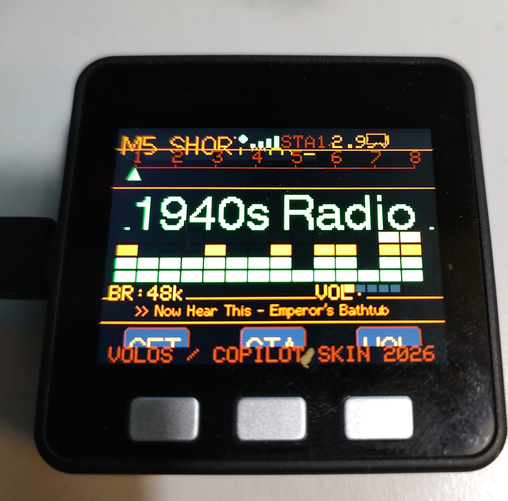

# M5RadioStream 📻

WiFi Internet Radio for the **M5Stack Core1 Basic** — a port of the excellent [winRadio](https://github.com/VolosR/WaveshareRadioStream) project by **Volos Projects**, re-skinned with a custom retro old-time radio aesthetic.

---

## 📷 Custom Skin Preview



> *Retro old-time skin running on M5Stack Core1 Basic — streaming 1940s Radio.*  
> Skin design: **VOLOS / COPILOT SKIN 2026**

---

## Credits

- **Original project:** [winRadio by Volos Projects](https://github.com/VolosR/WaveshareRadioStream)  
  Original hardware target: Waveshare ESP32-S3 with ST7789 240×240 display.  
  All core audio streaming logic, station management, and UI concept by Volos Projects.

- **This port:** Adapted for M5Stack Core1 Basic (ESP32, ILI9341 320×240, 3 physical buttons) with a custom retro skin.

---

## Hardware

| Component | Details |
|-----------|---------|
| Board | M5Stack Core1 Basic |
| MCU | ESP32 |
| Display | ILI9341 320×240 |
| Audio out | ESP32 internal DAC (GPIO25) |
| Controls | 3 physical buttons (A / B / C) |

---

## Features

- WiFi internet radio streaming (ESP32-audioI2S)
- Retro old-time radio UI skin
- 8 preset stations (ROKiT Radio Network classic/OTR streams, 48 kbps MP3)
- Scrolling song/metadata ticker
- VU meter bar graph
- Bass / Treble / Volume controls
- WiFi credentials stored in NVS via captive portal setup
- Hold **BtnA** during 3-second boot window to re-enter WiFi setup

---

## Button Mapping

| Button | Normal Mode | Sound Settings Mode |
|--------|-------------|-------------------|
| **BtnA** (left) | Open sound settings | Exit back to radio |
| **BtnB** (middle) | Cycle station | Select next parameter |
| **BtnC** (right) | Cycle volume | Increase selected parameter |

---

## Build & Flash

```bash
# Using PlatformIO
pio run --target upload
pio device monitor
```

Dependencies (auto-installed via `platformio.ini`):
- `m5stack/M5Stack`
- `esphome/ESP32-audioI2S`

---

## License

Original work © Volos Projects — see the [upstream repository](https://github.com/VolosR/WaveshareRadioStream) for license details.  
Port & skin modifications made in 2026.
